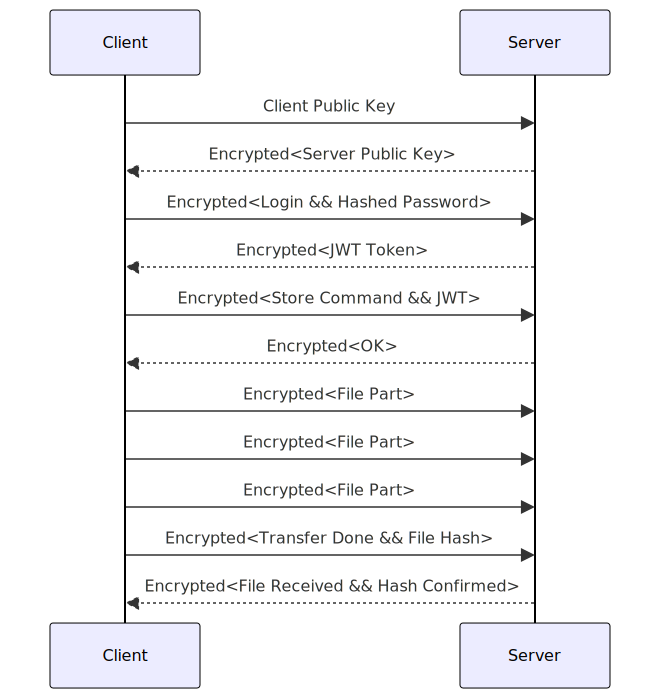

*This part of the work will first require you to determine the system architecture as well as the security
architecture. Your system architecture will have to cope with a major requirement: your boss has
selected a client server communications library from Macrohard Corporation as a middleware for
implementing data transfers, which you must incorporate into your design. Unfortunately, this library
does not implement any security mechanism.*

*Your security architecture will have to describe how security countermeasures are introduced into the
system architecture and how they interact. The security countermeasures will be determined based
on the threat model that you also have to establish. Such countermeasures typically include access
control and cryptography. The threat model will investigate security and privacy threats to the
application and will also have to be documented.*

## 1. System Architecture

The system architecture is based on a client-server model. 
We have noted in the requirements that the client can connect from "Home", that means communication between the client and the server will be done over potentially insecure networks, thus the need to encrypt our communications.

### 1.1. Client

The client will have 4 major components:

- A CLI (Command Line Interface) that will allow the user to interact with the system.
- A File Management Library that will allow the client to upload, download, delete and list files on the server.
- A cryptographic module that will allow the client to encrypt and decrypt the files, authenticate the users and encrypt the connection between the client and the server.
- The Microhard library that will allow the client to communicate with the server.

### 1.2. Server

The server will have 4 major components:

- A REST API that will allow the client to communicate with the server.
- The Microhard library that will allow the server to communicate with the client.
- A database that will store metadata about the files and the users.
- A cryptographic module that will allow the server to encrypt and decrypt the files, authenticate the users and encrypt the connection between the client and the server.

### 1.3. Communication

Here is an example of a communication between the client and the server for a file upload:

## 2. Security Architecture:

2.1 Threat Model:

We have noted 3 major threats to the system:

- Unauthorized access to the system.
    Potentially sensitive files could be stored on the server, thus the need to protect them from unauthorized access. We will concentrate on protecting the files from being accessed by unauthorized users as a server but will rely on the unix permissions to protect the files from being accessed by unauthorized users as a process.
- Remote code execution.
    The server will be running on a remote machine, thus the need to protect it from remote code execution. We could reduce the risk of remote code execution by running the server as a non-root user and by running it in a container.
- Data breaches.
    The server will be storing potentially sensitive data, thus the need to protect it from data breaches. We could reduce the risk of data breaches by encrypting the data at rest and by encrypting the connection between the client and the server.

2.2 Access Control:

The access control will be very simple as this is a small project, I will only implement 2 roles:
- Authenticated User: The authenticated user will be able to read, create, update and delete files.
- Anonymous User: The anonymous user won't be able to read, create, update or delete files.

2.3 Cryptographic Measures:
To ensure data confidentiality, integrity and authenticity, I will use the following cryptographic measures:

- Encryption of the connection between the client and the server using a cryptographic protocol.
- Storage of files hashed with a cryptographic hash function in the database.
- Encryption of the files at rest using a cryptographic protocol.

2.4 Security Monitoring and Logging:
We will implement a logging system that will log all the actions performed by the users. This will allow us to monitor the system and to detect suspicious activities.

## 3. Integration of Security Measures:

Both Client and Server will use a cryptographic module that will implement the cryptographic measures described above.
The Server will also use a sqlite database to store the metadata about the files and the users.